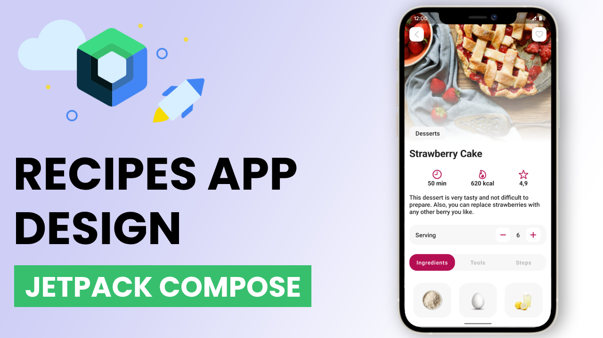

# Recipes Mobile App UI Design

Beautiful android mobile Recipes App designed using Jetpack Compose. Single screen design shows all important information about the recipe - Strawberry Cake.

Main elements of the screen:
- Scrollable top app bar with big image and scroll-to-fade feature.
- Interactive serving calculator.
- List of ingredients.
- Custom buttons.
- List of images.

### Preview

## Contributing

1. Fork it (<https://github.com/tokhy1/Recipe_UI.git/fork>)
2. Create your feature branch (`git checkout -b feature/fooBar`)
3. Commit your changes (`git commit -am 'Add some fooBar'`)
4. Push to the branch (`git push origin feature/fooBar`)
5. Create a new Pull Request

## Contact 
If you have any question or any suggestions, get in touch with me at mohamed21346587@gmail.com

Happy Coding!
